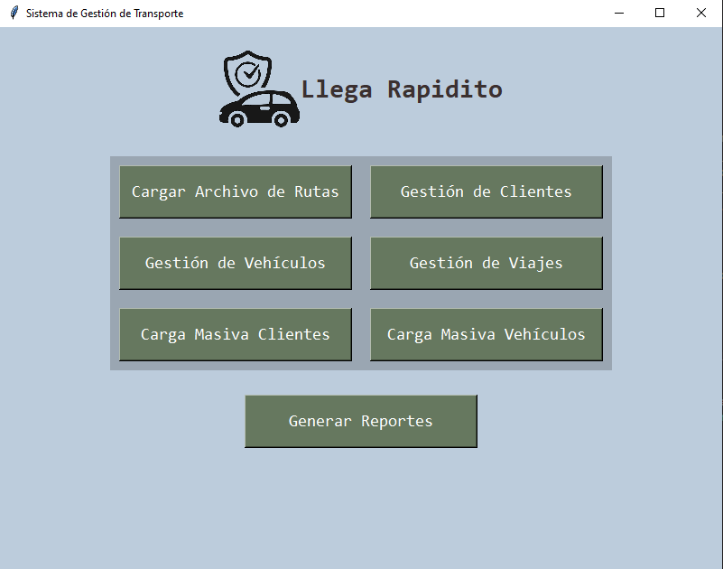
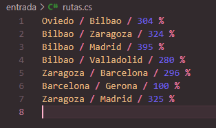
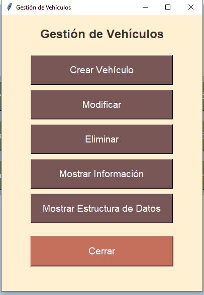

# Manual de Usuario para el Sistema de Gestión de Transporte

## Descripción General
El **Sistema de Gestión de Transporte** es una aplicación de escritorio diseñada para gestionar clientes, vehículos, rutas y viajes de una empresa de transporte. La aplicación ofrece funcionalidades como carga masiva de datos, gestión individual de registros y generación de reportes.

## Características
- Cargar rutas desde un archivo.
- Gestionar clientes y vehículos (añadir, modificar, eliminar).
- Administrar viajes, incluyendo la creación y selección de rutas.
- Generar reportes y visualizar estructuras de datos.


## Requisitos
- **Python** 3.8 o superior
- **Tkinter** (incluido con Python)
- **Pillow** para manejo de imágenes (`pip install pillow`)
- Otros módulos necesarios están incluidos en la estructura del proyecto.

## Instrucciones de Configuración
1. Clona o descarga los archivos del proyecto.
2. Instala los módulos requeridos usando pip:
    ```bash
    pip install pillow
    ```
3. Ejecuta el archivo `main.py` para iniciar la aplicación:
    ```bash
    python main.py
    ```

## Menú Principal
### Botones y Sus Funciones
1. **Cargar Archivo de Rutas**
   - Carga un archivo con rutas en el formato: `origen/destino/tiempo%`.
   - Ejemplo:
     ```
     Nueva York/Los Ángeles/300%
     ```
     
     
2. **Gestión de Clientes**
   - Agregar, modificar o eliminar información de clientes.
   - Ver la lista completa de clientes o la estructura de datos asociada.
   - 
3. **Gestión de Vehículos**
   - Agregar, modificar o eliminar información de vehículos.
   - Ver la lista completa de vehículos o la estructura de datos asociada.
   - 
4. **Gestión de Viajes**
   - Crear un viaje seleccionando un cliente, vehículo y ruta.
   - Ver detalles de los viajes creados.
   - 
5. **Carga Masiva de Datos**
   - Cargar clientes o vehículos de forma masiva desde archivos `.cs`.
   - 

## Formatos de Datos
### Archivo de Rutas
- Formato del archivo: `.cs`
- Ejemplo:
    ```
    origen/destino/tiempo%
    ```

### Archivo de Clientes
- Formato del archivo: `.cs`
- Ejemplo:
    ```
    dpi,nombre,apellido,género,teléfono,dirección
    ```

### Archivo de Vehículos
- Formato del archivo: `.cs`
- Ejemplo:
    ```
    placa:marca:modelo:precio_por_segundo
    ```

## Visualizaciones
- Las estructuras de datos, como grafos y listas, se visualizan usando Graphviz.

## Errores Comunes y Soluciones
1. **Error al cargar rutas**: Verifique que el formato del archivo sea correcto y siga la estructura especificada.
2. **Módulos no encontrados**: Instale los módulos requeridos usando pip.

## Notas Adicionales
- La aplicación proporciona retroalimentación visual mediante ventanas emergentes para mensajes de éxito o error.
- Asegúrese de que todos los archivos estén codificados en UTF-8 para un procesamiento adecuado.
